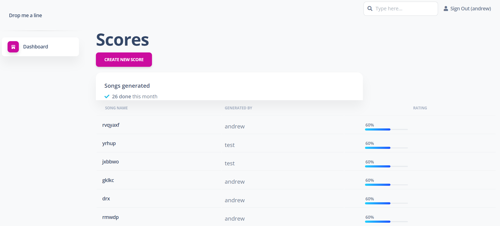
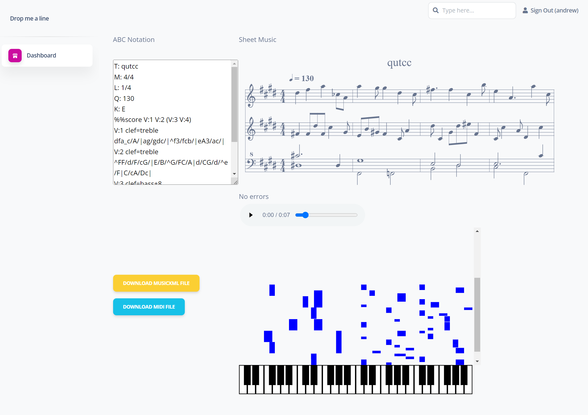

# b-project

So, one day my son and I went for a walk and started talking about this whole ChatGPT thing.

Well, he's into music and quite talented, so one day I was showing him some of what ChatGPT could do. We saw that it could generate various types of things, even some derivative lyrics. So we were tried to make it generate some music (which it is absolutely terrible at fwiw).

However... the process clued us into something called ABC Notation (https://abcnotation.com/). ChatGPT attempted to generate some poorly constructed music with that as its output. Well, We got to talking and I said, that ABC Notation is 'just a bunch of text', and you know that you can probably generate your own music with some python code.

So we did that. And this is that experiment.

We built a small django app around the core stuff he wrote to generate some simple 4 bar randomly generated music.

## Features

* Generate 4 bars of music with a click. 
* Listen to those 4 bars of music
* Download the MIDI format for that generated music
* Download the MusicXML format for that generated music (so you can use something like [MuseScore](https://musescore.org/) to edit or incorporate within another song).
* Review all generated music by anyone

What's not there yet/TODOs
* Rating system for generated music (some placeholder stuff is there at the moment)
* More cool stuff that we're thinking about, or you're thinking about.

## Try out the demo

### Link to Demo
https://bproject.projects.donarumo.com/

Try one of the [generated songs that sounds actually kinda cool](https://bproject.projects.donarumo.com/scores/20/).

### Dashboard

### Song Page



Note(s): 
* Might be slow to start - running with Google Cloud Run and sleeping when no one is using it.
* Login via Google Auth for now. Email not hooked up yet to allow for login/registration.

## Quickstart (w/o Dockerfile)

```
# Copy example ENV file to be your ENV file.
cp .env_example .env 

# Update the .env file with the appropriate variable values

pip install --upgrade pip pipenv

# In the directory with Pipfile
pipenv install

# Generate the database tables
pipenv run python manage.py migrate 

# Put the static files in the right place
pipenv run python manage.py collectstatic --noinput

# Load up the app (locally with django test webserver)
pipenv run python manage.py runserver
```

## Or use the Dockerfile
Currently the Dockerfile requires the .env and Database to be already set up. To be addressed in a subsequent deployment/build.

## We couldn't have done it without...

### Online ABC Notation Player
https://abc.rectanglered.com/

A website we used as some inspiration for how to display and edit ABC Notation, and how we got more familiar with the notation style

### abcjs
https://www.abcjs.net/

A library for managing ABC notation and displays within the browser

### ABC Notation
https://abcnotation.com/

The representation of the music itself in a nice, textual representation

### Music21
http://web.mit.edu/music21/

This library allows you to do so much with music in various formats, but it's a very nice 'quick and dirty' way to translate between formats.
